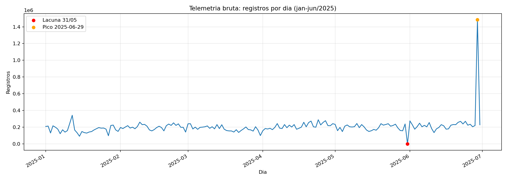
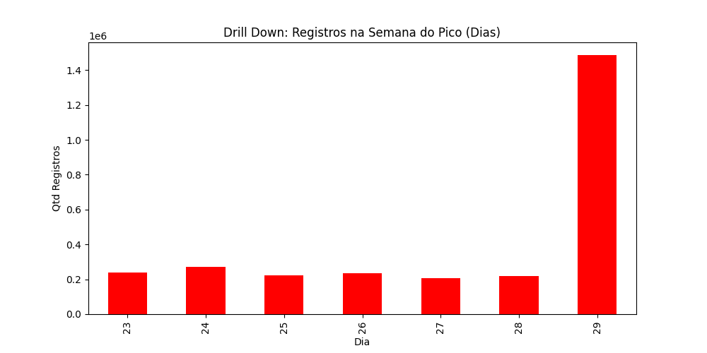
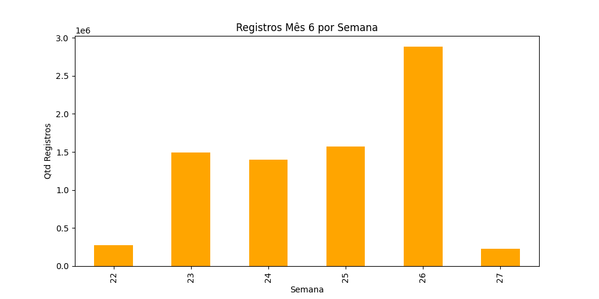
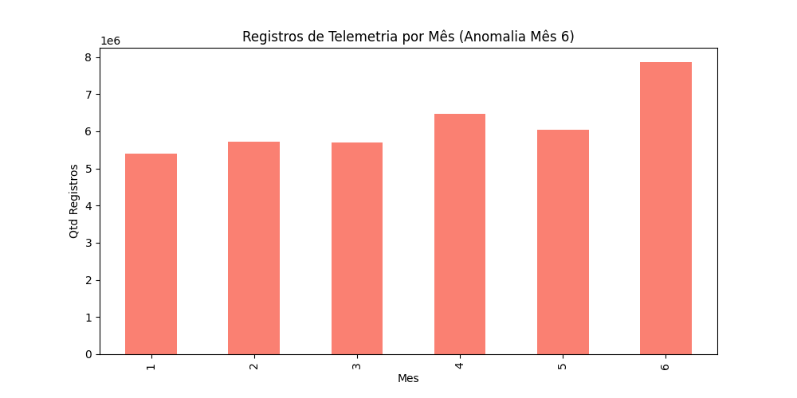
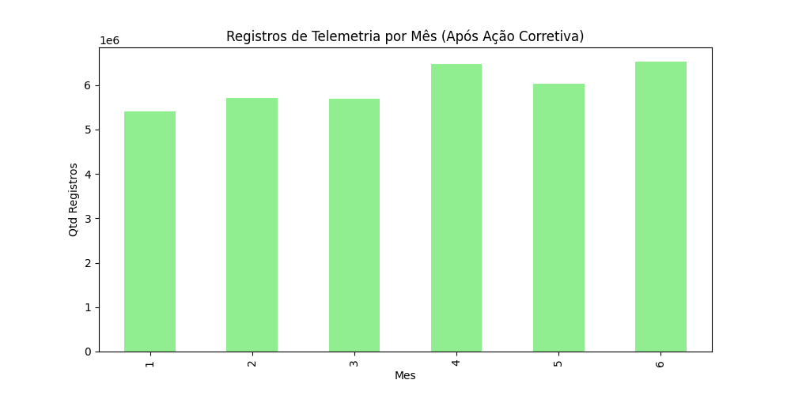
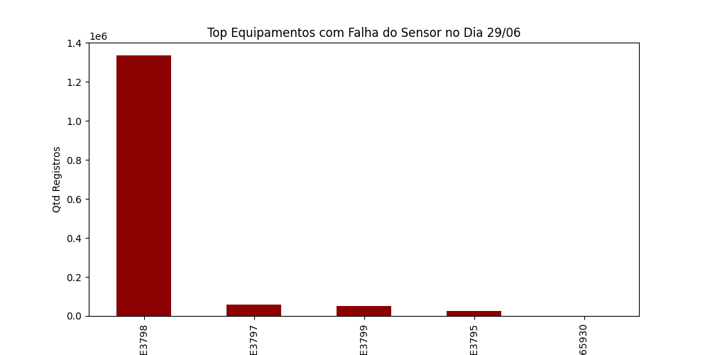

# Vale Correct — Relatório Final

## Resumo Executivo

Este projeto analisou dados de telemetria e apontamentos operacionais de equipamentos de mina para
antecipar eventos marcados como `Is_Dont_Go`. O objetivo não foi apenas treinar um modelo preditivo,
mas construir uma trilha auditável de decisões: cada exclusão, transformação, target, janela temporal,
métrica e valoração econômica foi justificada por evidência observada no dataset ou por hipótese
explicitamente testada.

A conclusão principal é que existe sinal temporal real para antecipar a recorrência de eventos
`Is_Dont_Go`, especialmente em caminhões 793-D. O melhor candidato operacional, sob as premissas
econômicas estimadas, é o modelo `multijanela_core_ids_textual + CatBoost` treinado apenas em
caminhões, com faixa candidata de threshold `0,390-0,440`.

Entretanto, o resultado não deve ser apresentado como ROI real. `Is_Dont_Go` não é falha confirmada,
os custos econômicos usados são cenários simulados com base em fontes públicas e os modelos de
escavadeira ainda não têm suporte estatístico suficiente com o target atual.

## 1. Contexto do Problema

O cenário analisado representa uma operação de mina com frota de equipamentos pesados. Os dados
disponíveis combinam:

- telemetria de equipamentos, contendo eventos de alarme, `TAG`, tipo/frota, data/hora e a flag
  `Is_Dont_Go`;
- apontamentos operacionais, contendo intervalos de operação, parada, hibernação e manutenção;
- dicionário de dados;
- catálogo/regras de alarmes.

O problema de negócio pode ser descrito como:

> Dado o comportamento recente dos alarmes de um equipamento, é possível antecipar um evento crítico
> `Is_Dont_Go` nas próximas horas e priorizar uma ação de manutenção ou inspeção?

Desde o início, foi adotada uma regra metodológica central:

> Nenhuma anomalia é erro por suposição. Nenhuma economia é ROI real sem custo observado. Nenhuma
> decisão metodológica é aceita sem contagem antes/depois e justificativa.

## 2. Fontes de Dados

Arquivos usados:

| Fonte | Caminho | Uso |
|---|---|---|
| Telemetria mensal | `data/raw/Base/datasets/telemetria/telemetry_*.parquet` | Eventos de alarme e target entregue |
| Lista Don't Go | `data/raw/Base/datasets/telemetria/desenvolver_dontgo.xlsx` | Referência original da flag |
| Apontamentos | `data/raw/Base/datasets/apontamentos/desenvolver_apontamentos.parquet` | Estados operacionais e manutenção |
| Catálogo de regras | `data/raw/Base/Alarmes - Regra de Negocio.xlsx` | Referência corporativa de alarmes |
| Dicionário | `data/raw/Base/Dicionario_Dados.xlsx` | Interpretação dos campos |

Os dados brutos foram preservados. Todas as exclusões ocorreram apenas em camadas analíticas
derivadas.

## 3. Auditoria Inicial dos Dados

### 3.1 Telemetria

Resumo da telemetria bruta:

| Métrica | Valor |
|---|---:|
| Registros brutos | 37.164.054 |
| `Id_Eventos_Telemetria` distintos | 37.164.054 |
| Período | 01/01/2025 a 30/06/2025 |
| TAGs | 35 |
| `Id_Alarme` distintos | 1.324 |
| Descrições distintas de alarme | 712 |
| Linhas `Is_Dont_Go = 1` | 19.962 |
| Lacuna global | 31/05/2025 |

Não foram encontrados nulos nos campos essenciais auditados: `TAG`, `Data_Evento`, `Alarme`,
`Tipo`, `Criticidade`, `Classe` e `Is_Dont_Go`.

### 3.2 Apontamentos

Resumo dos apontamentos:

| Métrica | Valor |
|---|---:|
| Registros | 377.907 |
| TAGs | 47 |
| Classes | Operando, Parado, Hibernando, Manutenção |
| Durações negativas | 0 |
| Durações iguais a zero | 0 |

Decisão:

- manter apontamentos como fonte auxiliar;
- não usá-los como verdade absoluta de falha;
- usar `Manutenção` apenas como proxy operacional, não como prova causal.

## 4. Auditoria do Target

O campo `Is_Dont_Go` foi tratado com cuidado. A auditoria concluiu que ele indica que um alarme
consta na lista entregue como Don't Go. Ele não comprova, sozinho:

- falha mecânica;
- parada do equipamento;
- downtime causado pelo alarme;
- início de um evento independente;
- cumprimento completo de uma regra corporativa.

Achados críticos:

| Achado | Evidência |
|---|---|
| Linhas positivas não são falhas independentes | 19.962 linhas positivas, mas muitas repetições próximas |
| Target ocorre muitas vezes com equipamento operando | 15.972 linhas positivas em `Operando` |
| Downtime histórico não mede parada causada | calculava tempo até próximo `Operando`, mesmo quando já estava operando |

Decisão:

- não chamar `Is_Dont_Go` de falha confirmada;
- não usar o downtime histórico como ROI;
- criar target provisório por episódio:

> início de pelo menos um novo episódio contendo `Is_Dont_Go = 1` nas próximas 8 horas.

## 5. Investigação de Qualidade e Tratamentos

### 5.1 Correções manuais de TAG

Foi investigada a hipótese de que `CA5926`, `CA65926`, `CA5927` e `CA65927` seriam erros de
nomenclatura.

Evidência:

- coexistem ao longo do semestre;
- possuem históricos próprios;
- aparecem em apontamentos;
- possuem frotas distintas em alguns casos.

Decisão:

- não fundir as TAGs;
- remover a correção manual histórica;
- tratar esses equipamentos como distintos.

### 5.2 Duplicatas

Achado:

| Tipo | Quantidade |
|---|---:|
| IDs repetidos | 0 |
| Duplicatas exatas excedentes, ignorando apenas ID | 265.564 |

Decisão:

- preservar todas as linhas nos dados brutos;
- na camada analítica, agrupar duplicatas exatas;
- manter o menor `Id_Eventos_Telemetria` como referência;
- preservar `ids_evento_no_grupo` para rastrear quantos IDs brutos cada linha representa.

Antes/depois:

| Etapa | Registros |
|---|---:|
| Telemetria bruta | 37.164.054 |
| Após retirada apenas das duplicatas exatas na camada analítica | 36.898.490 |

Observação:

- a redução desta etapa é exatamente 265.564 registros;
- a queda maior, para 35.608.094 registros, ocorre somente depois do expurgo localizado do loop da
  `PE3798` em 29/06/2025, discutido na seção de picos de dados.

### 5.3 Nomes de alarmes

Foram encontrados conflitos entre `Id_Alarme` e descrição textual após normalização de espaços,
acentuação, capitalização e sufixos como `(L-1850)`.

Contagens:

| Métrica | Antes | Depois da normalização textual |
|---|---:|---:|
| Descrições distintas de `Alarme` | 712 | 592 |
| Pares distintos `Id_Alarme + Alarme` | 1.447 | 1.336 |
| `Id_Alarme` distintos | 1.324 | 1.324 |

Exemplos reais:

| `Id_Alarme` | Texto bruto | Conceito normalizado |
|---:|---|---|
| 16809772 | `MI - FILTRO ÓLEO MOTOR OBSTRUÍDO >69KPa` | `MI FILTRO OLEO MOTOR OBSTRUIDO 69KPA` |
| 16830615 | `TCS-Falha Sensor de Rotação da Roda TRAS DIR` | `TCS FALHA SENSOR DE ROTACAO DA RODA TRAS DIR` |
| 1074007969 | `Auxiliary Steering System Fault (L-1850)` | `AUXILIARY STEERING SYSTEM FAULT` |
| 1074007974 | `Engine Red Lamp Active (L-1850)` | `ENGINE RED LAMP ACTIVE` |

Exemplos de conflito preservado:

| `Id_Alarme` | Variações brutas observadas | Decisão |
|---:|---|---|
| 16830976 | `PRESS??O ÓLEO`, `PRESSÃO ??LEO`, `PRESSÃO ÓLEO` | preservar `Id_Alarme`, normalizar texto e não inferir erro |
| 16833710 | `TESTE-OP ENTRADA ARTICULADA`, `TESTE-OP ENTRADA OPERAÇÃO ARTICULADA.` | tratar como conceitos próximos, não fundir automaticamente |

Decisão:

- usar `Id_Alarme` como chave principal;
- preservar texto bruto;
- criar `conceito_alarme_textual` por normalização determinística;
- evitar famílias amplas por similaridade textual sem evidência técnica.

## 6. Lacunas e Picos de Dados

A análise temporal de volume por dia foi fundamental para detectar dois fenômenos: uma lacuna global
em `31/05/2025` e um pico localizado em `29/06/2025`.

> Observação: durante a discussão apareceu a data `29/07`, mas o dataset termina em `30/06/2025`.
> O pico auditado foi em `29/06/2025`.

### 6.1 Visualização de volumes e motivação do drill-down

As primeiras evidências vieram da plotagem da quantidade de observações por dia na telemetria bruta.
Esse gráfico mostrou dois pontos que exigiam investigação: ausência total de registros em 31/05 e
pico extremo em 29/06.



A partir desse gráfico diário, o drill-down foi feito em junho, por semana e depois por dia, para
localizar qual equipamento e quais alarmes explicavam o pico.





Também foram preservadas visualizações do mês antes/depois da investigação:





### 6.2 Lacuna global de 31/05/2025

Achado:

- ausência global de registros de telemetria em `31/05/2025`.

Investigação:

- o dia não foi preenchido com zeros;
- zero significaria equipamento observado sem alarmes;
- o que existe é ausência de observação;
- foi feita pesquisa externa em 02/07/2026 sobre eventos públicos associados a Vale, mineração,
  paralisação, apagão, barragens, Carajás e interrupções operacionais;
- não foi encontrado fato público que sustente associar a lacuna a uma parada geral.

Decisão:

- tratar `31/05/2025` como lacuna global de observação/ingestão;
- invalidar amostras cuja janela de observação ou horizonte atravesse essa lacuna;
- não imputar zeros;
- não interpretar como parada operacional confirmada.

### 6.3 Pico PE3798 em 29/06/2025

Fio da investigação:

1. O gráfico diário bruto indicou pico extremo em `29/06/2025`.
2. O drill-down por mês/semana/dia mostrou que o pico estava concentrado em junho.
3. A abertura por `TAG` identificou a `PE3798` como principal responsável.
4. A abertura por `Id_Alarme` mostrou que dois alarmes Remote PTO explicavam praticamente todo o
   excesso.

Achado:

- `PE3798` teve 1.334.065 registros em `29/06/2025`;
- dois alarmes Remote PTO explicaram 1.290.396 registros;
- nenhum deles tinha `Is_Dont_Go`;
- os sinais alternavam em dezenas de milissegundos.

| Id_Alarme | Descrição | Registros |
|---:|---|---:|
| 1241582851 | Remote PTO - Not Configured | 645.199 |
| 1241582848 | Remote PTO - Switch Off | 645.197 |

Drill-down:



Decisão:

- expurgar somente a combinação:

```text
TAG = PE3798
data = 2025-06-29
Id_Alarme IN (1241582851, 1241582848)
```

- preservar os outros 43.669 registros da `PE3798` no mesmo dia;
- preservar esses dois alarmes em outros dias/equipamentos;
- não criar regra universal para remover outros volumes altos.

Antes/depois consolidado da limpeza analítica:

| Etapa | Registros |
|---|---:|
| Telemetria bruta | 37.164.054 |
| Após retirada de duplicatas exatas | 36.898.490 |
| Após expurgo localizado do loop Remote PTO | 35.608.094 |

## 7. Estados Operacionais e Hibernando

Foi investigado se alarmes emitidos em `Hibernando` ou em estados sobrepostos deveriam ser
descartados.

Achados:

- `CA65789` possui 427 sobreposições envolvendo `Hibernando`;
- outras máquinas também emitem alarmes enquanto estão exclusivamente `Hibernando` ou `Parado`;
- há 131 linhas `Dont Go` em estado `Hibernando`.

Experimentos com features de estado mostraram:

| Cenário | PR-AUC | Precisão | Recall | F2 | Predições positivas |
|---|---:|---:|---:|---:|---:|
| RF baseline IDs | 0,330 | 0,210 | 0,752 | 0,496 | 1.038 |
| XGB baseline IDs | 0,322 | 0,183 | 0,797 | 0,477 | 1.262 |
| XGB estado sem Hibernando | 0,340 | 0,245 | 0,583 | 0,457 | 691 |
| XGB estado com Hibernando | 0,341 | 0,202 | 0,721 | 0,476 | 1.035 |
| XGB flags Hibernando | 0,342 | 0,191 | 0,731 | 0,467 | 1.112 |
| XGB flags sem CA65789 | 0,340 | 0,187 | 0,794 | 0,482 | 1.218 |

Leitura:

- features de estado melhoraram pouco PR-AUC;
- nenhum cenário superou o RF baseline em F2;
- retirar `CA65789` não alterou a conclusão geral;
- remover `Hibernando` aumentou precisão, mas reduziu recall de forma relevante.

Decisão:

- não excluir `Hibernando`;
- não tratar `Hibernando` como erro automático;
- manter estado operacional como feature experimental, não como regra de limpeza.

## 8. Formação de Episódios e Janelas Temporais

A telemetria não é emitida de forma regular. A mediana global entre registros consecutivos do mesmo
`TAG + Id_Alarme` é aproximadamente 6,1 segundos, mas há sinais em milissegundos e outros separados
por minutos ou horas.

Neste projeto, `gap` significa o tempo máximo permitido entre dois registros consecutivos do mesmo
`TAG + Id_Alarme` para que eles ainda sejam considerados parte do mesmo episódio. Se o intervalo
passa desse limite, inicia-se um novo episódio.

Decisão inicial:

- formar episódios por `TAG + Id_Alarme`;
- novo episódio quando o intervalo excede um gap definido;
- começar com gap de 60 segundos apenas como baseline auditável.

Testes posteriores avaliaram gaps de 30s, 60s, 120s, 300s, 450s, 600s, 900s, 1200s e superiores.

Primeira rodada, com janela fixa 8h/8h:

| Gap | Sequências | Sequências Dont Go | PR-AUC | Precisão | Recall | F2 | FP | FN |
|---:|---:|---:|---:|---:|---:|---:|---:|---:|
| 30s | 8.712.278 | 16.845 | 0,325 | 0,197 | 0,828 | 0,504 | 980 | 50 |
| 60s | 4.303.625 | 14.612 | 0,328 | 0,210 | 0,745 | 0,493 | 813 | 74 |
| 900s | 979.994 | 7.572 | 0,343 | 0,215 | 0,751 | 0,501 | 792 | 72 |
| 3600s | 422.227 | 4.689 | 0,272 | 0,179 | 0,772 | 0,465 | 974 | 63 |

Teste de janelas usando gap 900s:

| Observação | Horizonte | PR-AUC | Precisão | Recall | F2 | FP | FN |
|---:|---:|---:|---:|---:|---:|---:|---:|
| 24h | 24h | 0,509 | 0,306 | 0,940 | 0,665 | 1.218 | 34 |
| 24h | 8h | 0,348 | 0,205 | 0,821 | 0,512 | 910 | 51 |
| 8h | 8h | 0,343 | 0,215 | 0,751 | 0,501 | 792 | 72 |
| 12h | 8h | 0,329 | 0,193 | 0,832 | 0,500 | 1.012 | 49 |
| 4h | 4h | 0,327 | 0,242 | 0,503 | 0,413 | 304 | 96 |

Refino com janela 24h/8h:

| Gap | Val F2 | Teste PR-AUC | Teste F2 | Teste FP | Teste FN |
|---:|---:|---:|---:|---:|---:|
| 450s | 0,489 | 0,335 | 0,501 | 986 | 49 |
| 600s | 0,485 | 0,334 | 0,516 | 977 | 42 |
| 900s | 0,471 | 0,348 | 0,512 | 910 | 51 |
| 1200s | 0,475 | 0,340 | 0,510 | 1.007 | 41 |

Decisão temporal consolidada:

- usar `gap=900s`, mesmo não sendo o maior F2 isolado no teste, porque teve melhor PR-AUC no teste e
  menos falsos positivos entre os gaps competitivos;
- observação de 24h;
- horizonte de 8h;
- manter `8h/8h` como baseline histórico;
- não adotar `24h/24h` como principal porque muda a natureza operacional do target.

## 9. Evolução dos Modelos

### 9.1 Baseline histórico

Configuração:

- gap 60s;
- observação 8h;
- horizonte 8h;
- treino janeiro-abril;
- validação maio;
- teste junho;
- vocabulário dos 200 `Id_Alarme` mais frequentes apenas no treino;
- threshold escolhido apenas na validação.

Separação temporal:

| Split | Período | Uso |
|---|---|---|
| Treino | Janeiro a abril | ajustar modelo e vocabulário |
| Validação | Maio, exceto janelas cruzando 31/05 | escolher threshold |
| Teste | Junho | avaliação final sem ajuste |

Regra de auditoria:

- nenhum split aleatório foi usado;
- nenhuma feature foi selecionada olhando teste;
- thresholds foram definidos antes de medir teste;
- janelas que cruzavam a lacuna de 31/05 foram invalidadas.

Resultado no teste:

| Modelo | PR-AUC | Precisão | Recall | F2 | TP | FP | FN | TN |
|---|---:|---:|---:|---:|---:|---:|---:|---:|
| RandomForest com IDs | 0,330 | 0,210 | 0,752 | 0,496 | 218 | 820 | 72 | 2.005 |

Decisão:

- o baseline mostra sinal real;
- ainda gera muitos falsos positivos;
- não comprova falha mecânica nem causalidade.

### 9.2 Conceitos de alarme

Foi criado `conceito_alarme_textual` por normalização determinística do campo `Alarme`.

O que foi feito:

- trim de espaços;
- conversão para maiúsculas;
- normalização Unicode;
- remoção de acentos;
- remoção de sufixo `(L-1850)`;
- troca de pontuação por espaço;
- colapso de múltiplos espaços.

Antes/depois:

| Métrica | Antes | Depois |
|---|---:|---:|
| Descrições distintas de alarme | 712 | 592 |
| Pares `Id_Alarme + descrição` | 1.447 | 1.336 |

Resultado:

| Modelo | PR-AUC | Precisão | Recall | F2 | FP | FN |
|---|---:|---:|---:|---:|---:|---:|
| RF IDs + conceitos textuais | 0,346 | 0,205 | 0,834 | 0,518 | 936 | 48 |
| RF IDs baseline | 0,330 | 0,210 | 0,752 | 0,496 | 820 | 72 |

Decisão:

- conceitos textuais agregam sinal;
- o ganho de recall aumenta FP;
- manter conceitos textuais como feature relevante.

### 9.3 Mapa manual de famílias

Foi testado um mapa manual pequeno de famílias.

O que foi feito:

- agrupar conceitos tecnicamente próximos em famílias pequenas;
- começar pelos alarmes recorrentes em erros e positivos reais;
- criar famílias como `COMUNICACAO_INTERFACE`, `OPERACAO_CARGA_BASCULAMENTO`,
  `PNEUS_MONITORAMENTO`, `MOTOR_ARREFECIMENTO`, `FREIOS`, `TREM_FORCA`, `DIRECAO` e `ELETRICO`;
- tratar o mapa como experimento, pois foi orientado por auditoria de erros já conhecida.

Resultados:

| Modelo | PR-AUC | Precisão | Recall | F2 | FP | FN |
|---|---:|---:|---:|---:|---:|---:|
| RF IDs + conceitos textuais | 0,346 | 0,205 | 0,834 | 0,518 | 936 | 48 |
| RF IDs + famílias manuais | 0,333 | 0,215 | 0,762 | 0,505 | 806 | 69 |
| RF IDs + conceitos manuais | 0,337 | 0,198 | 0,821 | 0,503 | 967 | 52 |
| RF IDs baseline | 0,330 | 0,210 | 0,752 | 0,496 | 820 | 72 |

Decisão:

- útil para interpretabilidade e redução localizada de FP;
- não superou conceitos textuais como feature principal;
- não expandir taxonomia manual sem nova validação temporal.

### 9.4 Nova referência técnica

Com `gap=900s`, observação 24h, horizonte 8h e `IDs + conceitos textuais`:

| Modelo | PR-AUC | Precisão | Recall | F2 | TP | FP | FN | TN |
|---|---:|---:|---:|---:|---:|---:|---:|---:|
| Baseline 60s 8h/8h IDs | 0,328 | 0,210 | 0,745 | 0,493 | 216 | 813 | 74 | 2.012 |
| Referência 900s 24h/8h IDs + conceitos | 0,333 | 0,227 | 0,730 | 0,505 | 208 | 710 | 77 | 2.050 |

Decisão:

- manter a nova referência por reduzir 103 FP e melhorar F2/precisão;
- aceitar pequena perda de recall;
- preservar baseline histórico para comparação.

### 9.5 Multijanelas

A multijanela core separou as 24h em buckets 0-8h, 8-16h e 16-24h para capturar recência.

Não há vazamento de dados futuros. Para cada instante de predição:

- o bucket 0-8h contém apenas alarmes entre `prediction_time - 8h` e `prediction_time`;
- o bucket 8-16h contém apenas alarmes entre `prediction_time - 16h` e `prediction_time - 8h`;
- o bucket 16-24h contém apenas alarmes entre `prediction_time - 24h` e `prediction_time - 16h`;
- o target fica separado, nas 8h posteriores ao `prediction_time`;
- qualquer amostra que cruzasse 31/05 foi invalidada.

Resultado:

| Cenário | PR-AUC | Precisão | Recall | F2 | TP | FP | FN |
|---|---:|---:|---:|---:|---:|---:|---:|
| Referência agregada | 0,333 | 0,227 | 0,730 | 0,505 | 208 | 710 | 77 |
| Multijanela core | 0,363 | 0,188 | 0,877 | 0,506 | 250 | 1.082 | 35 |

Decisão:

- multijanelas aumentam recall e PR-AUC;
- adicionam muitos falsos positivos;
- não substituir a referência técnica por F2;
- preservar como candidato econômico se custo de FN for alto.

## 10. Validação Operacional com Manutenção

Foi investigada a associação entre episódios `Is_Dont_Go` e apontamentos `Manutenção`.

Achados para caminhões:

| Split | Episódios DG | Com manutenção em 8h | Taxa |
|---|---:|---:|---:|
| Treino | 6.030 | 3.951 | 0,655 |
| Validação | 689 | 543 | 0,788 |
| Teste | 811 | 609 | 0,751 |

Decisão:

- existe associação temporal observável entre `Is_Dont_Go` e manutenção posterior em caminhões;
- usar `0,655` como `p_acao_confirmada` base, derivada apenas do treino;
- não usar taxa de escavadeiras por falta de volume;
- não transformar `Manutenção` em target principal sem separar preventiva, corretiva e rotina.

## 11. Calibração, Algoritmos e Threshold Econômico

Foram comparados RandomForest, XGBoost, LightGBM e CatBoost com calibração sigmoide e splits
temporais rolantes.

Ranking médio por valor incremental:

| Ranking | Combinação | Valor médio | Valor mínimo | Valor máximo | Precisão média | Recall médio |
|---:|---|---:|---:|---:|---:|---:|
| 1 | Multijanela + CatBoost | 2.379.933 | 1.652.600 | 3.319.800 | 0,415 | 0,312 |
| 2 | Multijanela + RandomForest | 2.165.200 | 1.569.200 | 2.742.700 | 0,420 | 0,280 |
| 3 | Referência + CatBoost | 2.158.100 | 861.100 | 2.894.300 | 0,412 | 0,296 |
| 4 | Multijanela + XGBoost | 1.955.167 | 608.000 | 3.820.200 | 0,406 | 0,287 |

Decisão:

- adotar `multijanela_core_ids_textual + CatBoost + calibração sigmoide` como candidato econômico;
- manter `referencia_24h_ids_textual + RandomForest` como baseline auditável;
- manter XGBoost como sensibilidade.

## 12. Caminhões e Escavadeiras

Escavadeiras têm grande volume de telemetria, mas poucos eventos positivos:

| Tipo | TAGs | Positivos por mês |
|---|---:|---:|
| Caminhão | 30 | 280 a 560 |
| Escavadeira | 5 | 1, 6, 1, 1, 7, 2 |

Decisão:

- treinar modelos de escavadeira apenas como parâmetro;
- não recomendar uso operacional em escavadeiras com este target;
- registrar que o impacto econômico potencial pode ser alto, mas não é capturado pelo modelo atual.

## 13. Candidato Final e Explicabilidade

Comparação final:

| Escopo/modelo | Faixa robusta | Valor médio máximo | Pior split mínimo |
|---|---:|---:|---:|
| Caminhões + CatBoost multijanela | 0,390-0,440 | 2.990.200 | 2.287.500 |
| Misto + CatBoost multijanela | 0,420-0,480 | 2.780.567 | 1.302.000 |
| Misto + RandomForest referência | 0,395-0,450 | 2.327.800 | 1.308.800 |
| Caminhões + RandomForest referência | 0,380-0,390 | 2.255.733 | 1.360.700 |

Explicabilidade:

- `ENGINE COOLANT LEVEL`, `PARKING BRAKE`, `OEM INTERFACE` e sinais de temperatura aparecem entre
  os fatores relevantes;
- features de recência por bucket temporal aparecem como importantes;
- exemplos locais de TP/FP mostram padrões tecnicamente plausíveis;
- falsos negativos de escavadeira ficam com probabilidade baixa, reforçando limitação do target.

Decisão:

- baseline auditável: `referencia_24h_ids_textual + RandomForest`;
- candidato operacional para caminhões: `multijanela_core_ids_textual + CatBoost`, threshold
  `0,390-0,440`;
- XGBoost como sensibilidade de alto recall;
- escavadeiras fora de recomendação operacional.

## 14. Valoração Econômica

As premissas econômicas externas foram documentadas em
`docs/PREMISSAS_ECONOMICAS_EXTERNAS.md`.

Fontes usadas:

- World Bank Pink Sheet para preço do minério;
- guidance público de custo caixa da Vale;
- especificações oficiais Caterpillar para payload do 793;
- referências públicas de componentes de caminhões fora de estrada;
- literatura de manutenção preditiva sensível a custo.

Valores unitários por cenário:

| Cenário | Tipo | Valor TP | Valor FP |
|---|---|---:|---:|
| Conservador | Caminhão | 13.000 | -30.000 |
| Base | Caminhão | 81.700 | -40.000 |
| Agressivo | Caminhão | 218.750 | -55.000 |
| Conservador | Escavadeira | 33.000 | -155.000 |
| Base | Escavadeira | 125.000 | -225.000 |
| Agressivo | Escavadeira | 675.000 | -325.000 |

Resultado médio nos três splits:

| Cenário | Melhor política | Valor médio | Leitura |
|---|---|---:|---|
| Conservador | `misto_catboost_multijanela` | -574.500 | FP custa caro; modelos ficam negativos |
| Base | `caminhoes_catboost_multijanela` | 2.990.200 | melhor equilíbrio médio |
| Agressivo | `caminhoes_xgboost_multijanela_validacao` | 12.437.083 | recall alto ganha valor |

Validação final em junho:

| Cenário | Melhor política em junho | Valor em junho |
|---|---|---:|
| Conservador | `misto_catboost_multijanela` | -262.000 |
| Base | `caminhoes_xgboost_multijanela_validacao` | 3.566.600 |
| Agressivo | `caminhoes_xgboost_multijanela_validacao` | 15.332.500 |

Decisão:

- sob cenário base, o CatBoost caminhão-only é o candidato mais defensável por estabilidade média;
- XGBoost vence junho no cenário base/agressivo, mas foi negativo em abril e não substitui CatBoost;
- cenário conservador mostra que custo de FP precisa ser validado antes de qualquer operação;
- valoração é simulação, não ROI real.

## 15. Conclusões

### 15.1 O que foi demonstrado

1. Existe sinal temporal real nos alarmes para antecipar recorrência de `Is_Dont_Go`.
2. A estrutura temporal importa: `gap=900s` e janela 24h/8h melhoraram a referência.
3. Conceitos textuais de alarme agregam sinal e reduzem fragmentação.
4. Multijanelas aumentam recall e passam a ser relevantes quando a decisão é econômica.
5. CatBoost multijanela é o melhor candidato econômico geral.
6. CatBoost caminhão-only é o candidato operacional mais defensável para caminhões.

### 15.2 O que não foi demonstrado

1. Não foi demonstrada previsão de falha mecânica confirmada.
2. Não foi demonstrado ROI real.
3. Não foi demonstrada recomendação operacional segura para escavadeiras.
4. Não foi demonstrado efeito causal de operador, manutenção ou alarme.

### 15.3 Recomendação operacional

Para os valores estimados descritos:

- usar `caminhoes_catboost_multijanela` como candidato operacional de caminhões;
- operar, se aprovado futuramente, com faixa de threshold candidata `0,390-0,440`;
- manter RandomForest referência como baseline auditável;
- manter XGBoost como sensibilidade de alto recall;
- não acionar política para escavadeiras com este target.

Para colocar em produção, a empresa precisa fornecer:

1. custos reais de intervenção preditiva;
2. custos reais de manutenção corretiva;
3. produção horária por equipamento ou frente;
4. tempo real de parada por evento;
5. ordens de serviço ligadas aos alarmes;
6. taxa real de conversão alerta -> ação útil;
7. regra operacional de quem recebe o alerta e qual ação deve ser tomada.

## 16. Trabalhos Futuros

1. Aderência financeira estrita.
   Substituir premissas públicas por custos internos extraídos do ERP, como SAP/Oracle: peças,
   terceiros, mão de obra, custo por hora de equipamento, produção por frente e custo de oportunidade.
   Isso transforma a valoração de cenário em estimativa financeira operacionalmente defensável.

2. Parametrização dinâmica da fila de manutenção.
   Usar a curva de threshold para ajustar a sensibilidade conforme a capacidade da oficina. Se há
   mecânicos e baias disponíveis, aumentar recall pode ser racional. Se a oficina está saturada,
   elevar threshold reduz FP e protege a fila. A decisão passa a ser um trade-off explícito entre
   risco evitado e capacidade operacional.

3. Enriquecimento com variáveis externas.
   Incluir chuva, lama, condição de pista, topografia/rampa, carga por eixo, balança, ciclo de
   transporte e frente de lavra. Essas variáveis podem explicar esforço mecânico que a telemetria de
   alarme sozinha não captura.

4. MLOps e inferência contínua.
   Transformar as janelas temporais em pipeline recorrente ou streaming, com atualização de features a
   cada novo bloco de telemetria e envio de alertas para supervisão/manutenção. Tecnologias como
   Kafka, jobs agendados, feature store e monitoramento de drift podem ser avaliadas conforme a
   infraestrutura da empresa.

5. Feedback loop da oficina.
   Criar mecanismo para o mecânico classificar o alerta após inspeção: dano encontrado, desgaste
   preventivo, falso alarme, intervenção adiada ou dado insuficiente. Esse retorno deve alimentar a
   revalidação mensal do modelo e permitir calibrar o custo real de FP/TP.

6. Ligação com ordens de serviço.
   Integrar alarmes, apontamentos e OS para separar manutenção preventiva, corretiva e rotina. Essa é a
   etapa mais importante para sair de `Is_Dont_Go` como proxy e chegar a um target operacional mais
   forte.

7. Escavadeiras.
   Criar formulação específica para escavadeiras, pois o impacto econômico potencial é alto, mas o
   target atual tem poucos positivos. Alternativas incluem mais histórico, target por manutenção
   corretiva, eventos de parada real ou custo de gargalo por frente.

8. Operadores.
   Investigar operador apenas como análise controlada, ajustando por `TAG`, turno, mês, frente,
   equipamento, tipo de operação e exposição. Sem esse controle, qualquer conclusão sobre operador
   seria enviesada e inadequada.

9. Validação offline antes de produção.
   Rodar o modelo em modo sombra por algumas semanas, sem acionar decisão automática, comparando
   alertas previstos com inspeções e OS reais.

10. Monitoramento de drift e recalibração.
    Acompanhar prevalência, calibração, taxa de FP/TP, mudança de mix de alarmes e estabilidade de
    threshold. Recalibrar probabilidades e thresholds com novos dados.

## 17. Trilha de Reprodutibilidade

Principais notebooks:

| Notebook | Papel |
|---|---|
| `01_Auditoria_e_Preparacao_Dos_Dados.ipynb` | auditoria estrutural e limpeza |
| `02_Aprofundamento_Das_Decisoes_Pendentes.ipynb` | decisões pendentes e anomalias |
| `03_Baseline_Episodios_8h.ipynb` | baseline auditável |
| `04_Auditoria_Do_Baseline_8h.ipynb` | auditoria de erros |
| `09_Teste_Gaps_E_Janelas_Temporais.ipynb` | gaps e janelas |
| `11_Conceitos_Familias_24h8h_Sensibilidade_Gap.ipynb` | conceitos/famílias |
| `13_Teste_Multijanelas_Temporais.ipynb` | multijanelas |
| `15_Validacao_Operacional_Target.ipynb` | ligação com manutenção |
| `17_Comparacao_Algoritmos_Calibrados.ipynb` | comparação de algoritmos |
| `18_Threshold_Robustez_Curva_Decisao.ipynb` | robustez de threshold |
| `19_Modelos_Por_Tipo_Equipamento.ipynb` | modelos por tipo |
| `20_Explicabilidade_E_Politica_Final.ipynb` | explicabilidade final |
| `22_Validacao_JunJul_Valoracao_Modelos.ipynb` | valoração final dos modelos |

Documentos de apoio:

- `docs/CONTINUIDADE_PROJETO.md`;
- `docs/RELATORIO_DECISOES_PROJETO.md`;
- `docs/PREMISSAS_ECONOMICAS_EXTERNAS.md`;
- `docs/auditoria_dados.md`;
- `docs/auditoria_dados_detalhes.md`.
